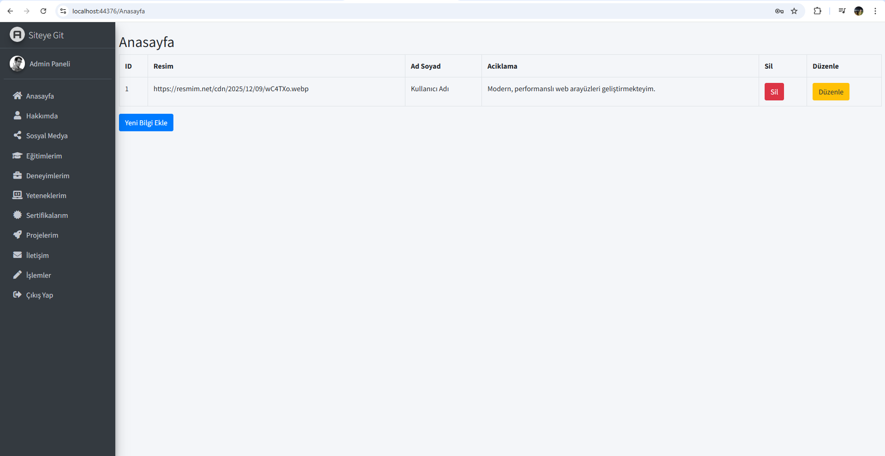
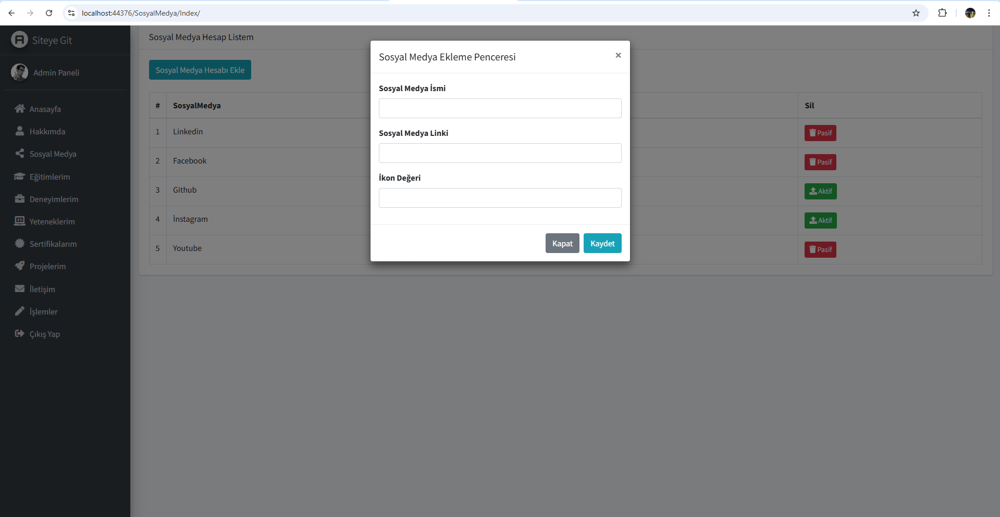
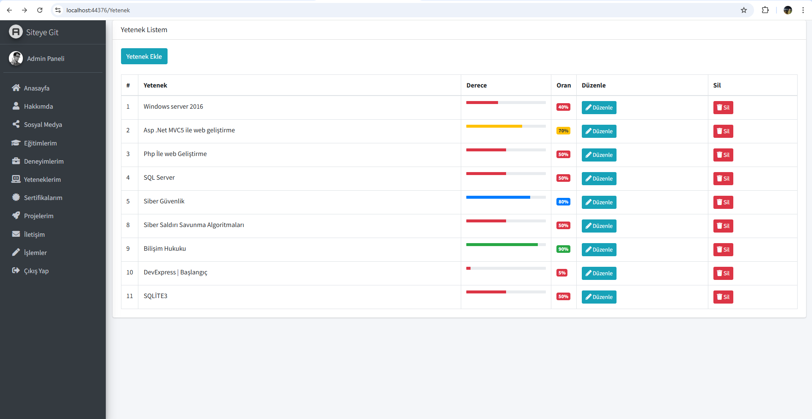
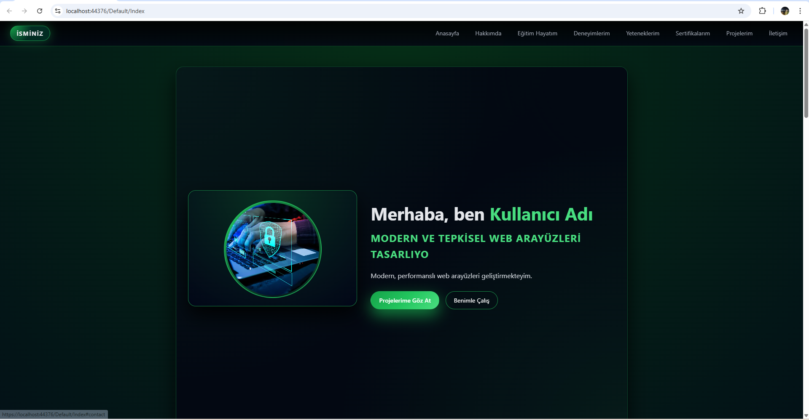
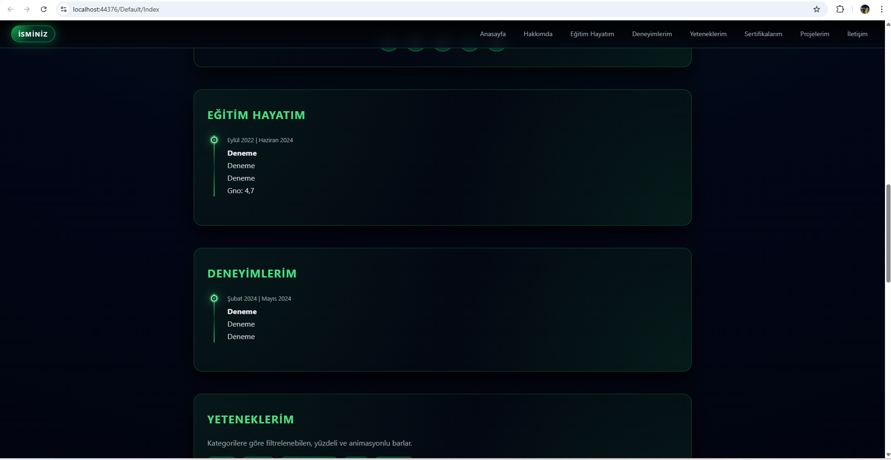
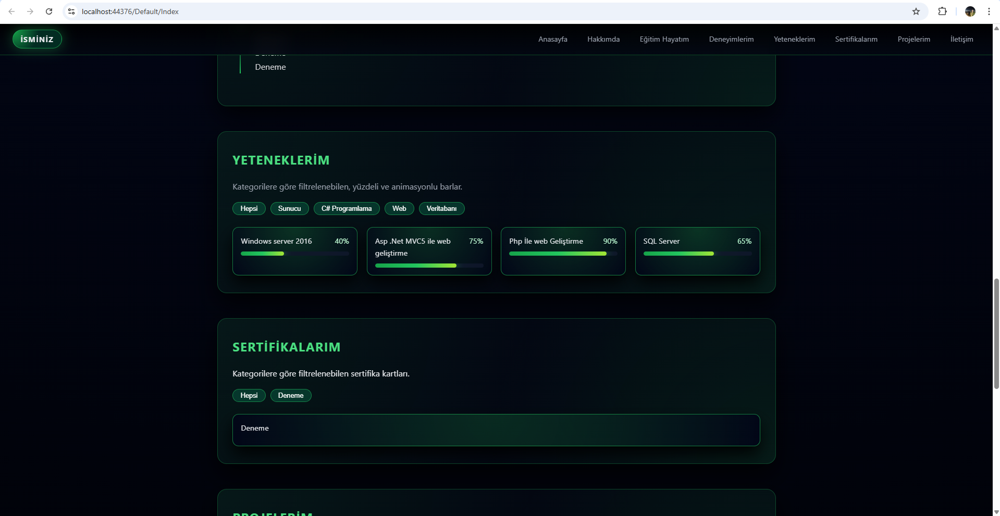
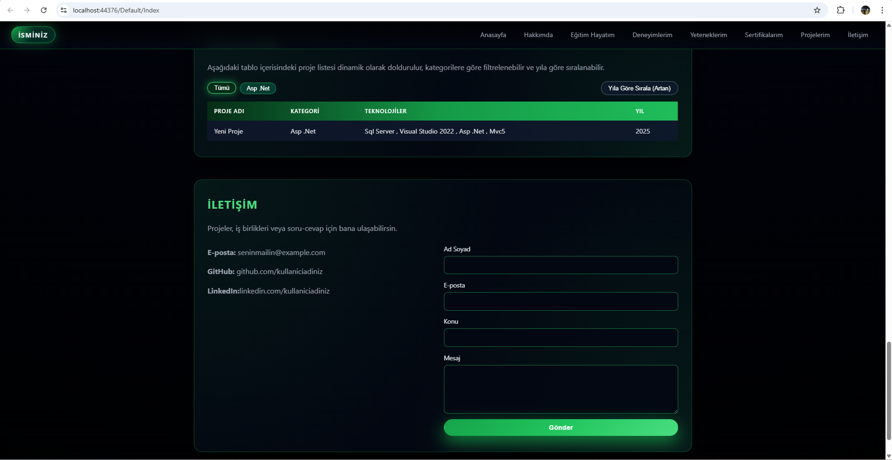
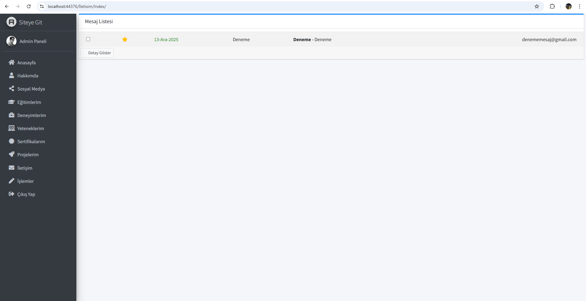

# M&Y Yazılım Eğitim Akademi - CvMvc

Bu proje, Murat Yüceadağ'ın Udemy platformunda paylaştığı **7.5 saatlik Dinamik Admin Panelli MVC5** eğitim projesidir.

CvMvc; kişiye ait CV verilerini web ortamında yönetip paylaşmaya yarayan bir portföy / CV projesidir.  
Admin paneli üzerinden kullanıcı bilgileri düzenlenebilir; ziyaretçiler ise iletişim bölümünden mesaj gönderebilir.

## Özellikler

- Admin tarafında **Login sistemi**
- Veritabanı tablolarının admin panelde listelenmesi ve yönetimi
- Admin kullanıcısı **ekleme / düzenleme / silme**
- Ziyaretçi tarafında CV/portföy sayfaları
- İletişim sayfası üzerinden mesaj gönderme
- **Dinamik yetenek sayfası**
- **Aktif / Pasif** durum yönetimi
- **Pop-up** ile veri ekleme ekranı
- **CRUD** işlemleri (Admin + Default tarafı sayfaların oluşturulması)
- **Validation:** kontrolleri (Required, MaxLength vb.)
- **Authorize** [AllowAnonimus] ile sayfa erişim kontrolleri vb , web confing ayarlamaları) 

## Kullanılan Teknolojiler

### Backend
- Dil: **C#**
- Veritabanı: **Microsoft SQL Server**
- Yaklaşım: **Entity Framework - Code First**
- Framework: **.NET Framework 4.7.2**
- Entity Framework: 5.0 

### Frontend
- Proje yapısı/tema: **Portfolio**, **AdminLTE**, **Login Form**
- Tasarım: Web sayfa tasarımı tarafıma aittir
- **HTML**, **CSS**, **JavaScript**
- **Bootstrap**

## Mimari & Tasarım Desenleri

Proje, MVC mimarisini takip eder:

- **Models / Entity**: Veritabanı varlık (entity) modelleri
- **Views & Shared**: Default ve Admin tarafı arayüz yapıları
- **Controllers**: İstekleri karşılayan controller sınıfları
- **Repository Design Pattern**: Kod tekrarını azaltmak için listele/ekle/sil/bul metotları

## Notlar

- Proje eğitim amaçlı geliştirilmiştir ve CV/portföy ihtiyaçlarını karşılayacak şekilde tasarlanmıştır.

## Ekran Görüntüleri 

